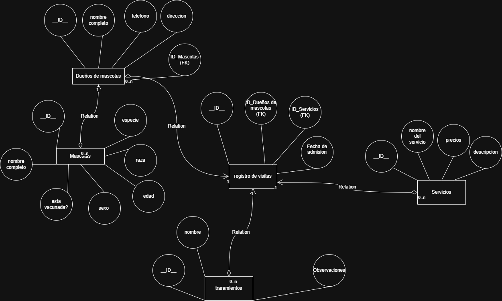

# Veterinaria mi mejor amigo

## Estructura y bases de datos para el funconamiento de la vererinaria

### Diagrama Inicial Para la estructuracion de la base de datos

Idea pricipal del desarrollo de la base de datos veterinaria mi mejor amigo la cual esta sujeta a cambios.

### Diagrama final de la estrucuta de la base de datos

## Video explicativo

[video explicativo de 1 hora :3](https://drive.google.com/file/d/1qeVvHCY6_gEQRSNMH_XdAxUSlDnnHcgg/view?usp=sharing)

# *Veterinaria Mi Mejor Amigo*

### Contexto

La veterinaria **“Mi Mejor Amigo”** es un centro de atención para mascotas que ofrece servicios médicos, de baño, estética y tratamientos. Recientemente, el personal administrativo ha tenido dificultades para llevar un registro eficiente de sus operaciones diarias, por lo que necesitan una base de datos que les permita organizar la siguiente información:

---

### 📋 Requerimientos funcionales

### 🧑‍⚕️ Dueños de Mascotas

- Se deben registrar los datos de los dueños: cédula, nombre completo, teléfono y dirección.
- Un dueño puede tener una o varias mascotas.

### 🐶 Mascotas

- Cada mascota debe tener registrado: nombre, especie (perro, gato, etc.), raza, edad, sexo y si está vacunada.
- Cada mascota pertenece a un solo dueño.

### 🧼 Servicios

- La veterinaria ofrece servicios como: baño, corte de uñas, consulta médica, desparasitación, vacunación, entre otros.
- Cada servicio tiene un nombre, una descripción y un precio base.

### 📅 Visitas

- Cuando una mascota es llevada a la veterinaria, se registra una **visita**.
- Cada visita está asociada a una mascota, un servicio recibido y una fecha.
- En una visita solo se realiza un servicio.
- Se necesita poder ver el historial de visitas de cada mascota.

### 💊 Tratamientos

- En algunas visitas, el veterinario receta uno o más tratamientos.
- Un tratamiento tiene: nombre, observaciones y está vinculado a una visita.

---

## 🧾 Entregables

### 1. Diagrama UML E-R

- Debe contener al menos las 5 entidades descritas (Dueño, Mascota, Servicio, Visita, Tratamiento).
- Deben especificarse relaciones, cardinalidades, llaves primarias y foráneas.
- Puede hacerse en **Draw.io, Lucidchart, DBDiagram o similar**.

---

### 2. Archivo DDL (`estructura.sql`)

- Instrucciones `CREATE TABLE` para todas las entidades y relaciones.
- Llaves primarias, foráneas y restricciones básicas.

---

### 3. Archivo DML (`datos.sql`)

- Inserta al menos:
    - 5 dueños
    - 10 mascotas
    - 5 servicios
    - 10 visitas
    - 5 tratamientos

⚠️ Si existen tablas adicionales deben tener al menos 5 registros

---

### 4. Archivo DQL (`consultas.sql`)

Debe contener **mínimo 15 consultas** que demuestren el uso de:

| Creación de tabla a partir de consulta |
| --- |
| Alias en campos |
| Alias en subconsultas |
| Funciones de agregación (COUNT, AVG, MAX, etc.) |
| Alias en funciones de agregación |
| `CONCAT` |
| `UPPER`, `LOWER` |
| `LENGTH`, `SUBSTRING`, `TRIM` |
| `ROUND` |
| `IF` en campos |

📌 Puedes incluir otras consultas adicionales como `JOIN`, `ORDER BY`, `GROUP BY`, etc.

---

### Entrega

- Se debe entregar todo en un repositorio con los archivos mencionados y un Readme que muestre el diseño y describa el proceso.
- Debe grabar la explicación de las consultas en un video y dejar el link en el Readme.
- Plazo máximo 22 de mayo de 2025 11:59 p.m.